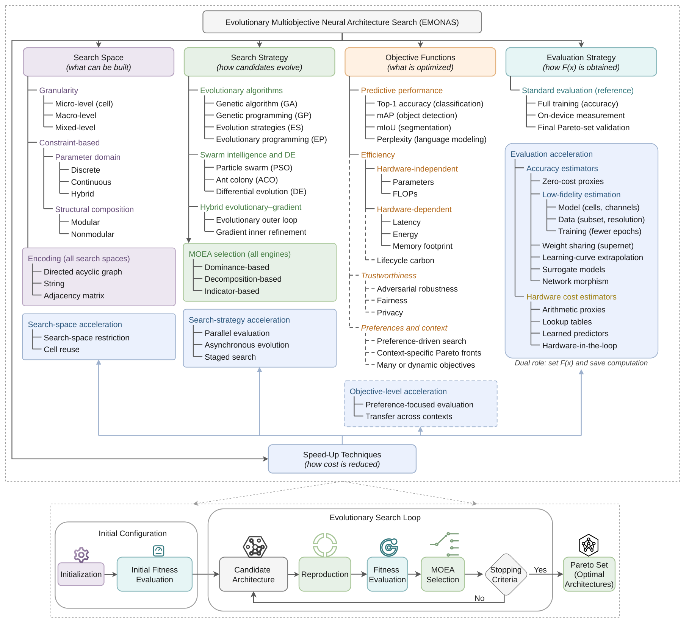

# Awesome Evolutionary Multiobjective Neural Architecture Search

Papers, code, benchmarks, and deployment guidance for evolutionary multiobjective neural architecture search.

**Maintainer:** [Yobsan Bayisa Leta](https://github.com/yobsanb)

Evolutionary multiobjective neural architecture search (**EMONAS**) uses evolutionary or related population-based methods to approximate a **Pareto set** of architectures under explicit objectives and constraints. It balances predictive performance with model complexity, latency, energy, memory, and, increasingly, robustness and lifecycle impact. The resulting trade-offs depend on the task, target device, software stack, and operating conditions.

## Contents

- [Scope](#scope)
- [Surveys](#surveys)
- [Benchmarks](#benchmarks)
- [Search Space](#search-space)
- [Search Strategy](#search-strategy)
- [Objective Functions](#objective-functions)
- [Evaluation Strategy](#evaluation-strategy)
- [Speed-Up Techniques](#speed-up-techniques)
- [Hardware-Aware NAS](#hardware-aware-nas)
- [Applications](#applications)
- [Emerging Directions](#emerging-directions)
- [Analysis and Tools](#analysis-and-tools)
- [Supporting Resources](#supporting-resources)
- [Minimum Reporting Checklist](#minimum-reporting-checklist)

## Scope
This collection used for the survey *Evolutionary Multiobjective Neural Architecture Search: Taxonomy, Benchmarks, Deployment-Driven Design, and Emerging Directions*. Its taxonomy has five interacting components: **search space, search strategy, objective functions, evaluation strategy, and speed-up techniques**. Hardware awareness spans all five.  It analyzes how search space, evolutionary search strategy, objective functions, evaluation strategy, and speed-up techniques interact, with hardware awareness considered across these components. The review also covers benchmarking, deployment-oriented optimization, robustness, sustainability, emerging architecture paradigms, hardware and software considerations, application domains, and reproducibility.

[View the taxonomy PDF](taxonomy.pdf)

---

## Surveys

The 19 surveys and reviews (S4) used to position the survey.

| Paper | Code |
|---|---|
| [Systematic review on neural architecture search (2025)](https://doi.org/10.1007/s10462-024-11058-w) | - |
| [Advances in Neural Architecture Search (2024)](https://doi.org/10.1093/nsr/nwae282) | - |
| [Evolutionary Spiking Neural Networks: A Survey (2024)](https://doi.org/10.1007/s41965-024-00156-x) | - |
| [A Survey on Multi-Objective Neural Architecture Search (2023)](https://arxiv.org/abs/2307.09099) | - |
| [Neural Architecture Search Benchmarks: Insights and Survey (2023)](https://arxiv.org/abs/2301.08727) | - |
| [Neural Architecture Search Survey: A Computer Vision Perspective (2023)](https://doi.org/10.3390/s23031713) | - |
| [Zero-cost estimators for neural architecture search: A survey (2023)](https://scholar.google.com/scholar_lookup?title=Zero-cost%20estimators%20for%20neural%20architecture%20search%3A%20A%20survey) | - |
| [A Survey on Computationally Efficient Neural Architecture Search (2022)](https://doi.org/10.1016/j.jai.2022.100002) | - |
| [AI and ML Accelerator Survey and Trends (2022)](https://doi.org/10.1109/HPEC55821.2022.9926331) | [areuther/ai-accelerators](https://github.com/areuther/ai-accelerators) |
| [Neural Architecture Search Survey: A Hardware Perspective (2022)](https://doi.org/10.1145/3524500) | - |
| [A Comprehensive Survey of Neural Architecture Search: Challenges and Solutions (2021)](https://arxiv.org/abs/2006.02903) | - |
| [A Comprehensive Survey on Hardware-Aware Neural Architecture Search (2021)](https://arxiv.org/abs/2101.09336) | - |
| [A Survey on Evolutionary Neural Architecture Search (2021)](https://doi.org/10.1109/TNNLS.2021.3100554) | - |
| [Hardware-Aware Neural Architecture Search: Survey and Taxonomy (2021)](https://doi.org/10.24963/ijcai.2021/592) | - |
| [Neuroevolution in Deep Neural Networks: Current Trends and Future Challenges (2021)](https://arxiv.org/abs/2006.05415) | - |
| [A Survey on Neural Architecture Search (2019)](https://arxiv.org/abs/1905.01392) | - |
| [Neural Architecture Search: A Survey (2019)](https://arxiv.org/abs/1808.05377) | - |
| [Reinforcement Learning for Neural Architecture Search: A Review (2019)](https://doi.org/10.1016/j.imavis.2019.06.005) | - |
| [When Neural Architecture Search Meets Hardware Implementation: From Hardware Awareness to Co-design (2019)](https://doi.org/10.1109/ISVLSI.2019.00014) | - |

## Benchmarks

The 19 NAS benchmarks and test suites (S2). They support different kinds of comparison: NAS-Bench-101/201 and NATS-Bench enable reproducible architecture queries; BenchENAS standardizes evolutionary NAS experiments; EvoXBench provides multiobjective test problems; HW-NAS-Bench exposes device costs; cross-task suites test transfer beyond classification.

Compare methods under matched search spaces, datasets, training protocols, candidate evaluation methods, and budgets. GPU days from full training, supernet evaluation, surrogate queries, and tabular lookup measure different work. Hypervolume comparisons also require the same objectives, normalization, and reference point. Benchmark results require validation on the intended deployment target.

| Paper | Code |
|---|---|
| [Neural Architecture Search as Multiobjective Optimization Benchmarks: Problem Formulation and Performance Assessment (2024)](https://doi.org/10.1109/TEVC.2022.3233364) | [EMI-Group/evoxbench](https://github.com/EMI-Group/evoxbench) |
| [BenchENAS: A Benchmarking Platform for Evolutionary Neural Architecture Search (2022)](https://arxiv.org/abs/2108.03856) | [benchenas/BenchENAS](https://github.com/benchenas/BenchENAS) |
| [JAHS-Bench-201: A Foundation for Research on Joint Architecture and Hyperparameter Search (2022)](https://openreview.net/forum?id=_HLcjaVlqJ) | [automl/jahs_bench_201](https://github.com/automl/jahs_bench_201) |
| [NAS-Bench-360: Benchmarking Neural Architecture Search on Diverse Tasks (2022)](https://arxiv.org/abs/2110.05668) | [rtu715/NAS-Bench-360](https://github.com/rtu715/NAS-Bench-360) |
| [NAS-Bench-Graph: Benchmarking Graph Neural Architecture Search (2022)](https://arxiv.org/abs/2206.09166) | [THUMNLab/NAS-Bench-Graph](https://github.com/THUMNLab/NAS-Bench-Graph) |
| [NAS-Bench-NLP: Neural Architecture Search Benchmark for Natural Language Processing (2022)](https://arxiv.org/abs/2006.07116) | [fmsnew/nas-bench-nlp-release](https://github.com/fmsnew/nas-bench-nlp-release) |
| [NAS-Bench-Suite-Zero: Accelerating Research on Zero Cost Proxies (2022)](https://arxiv.org/abs/2210.03230) | [automl/NASLib](https://github.com/automl/NASLib/tree/zerocost) |
| [NAS-Bench-Suite: NAS Evaluation is (Now) Surprisingly Easy (2022)](https://arxiv.org/abs/2201.13396) | [automl/NASLib](https://github.com/automl/NASLib) |
| [NAS-Bench-Zero: A Large-Scale Dataset for Understanding Zero-Shot Neural Architecture Search (2022)](https://openreview.net/forum?id=hP-SILoczR) | - |
| [Surrogate NAS Benchmarks: Going Beyond the Limited Search Spaces of Tabular NAS Benchmarks (2022)](https://arxiv.org/abs/2008.09777) | [automl/nasbench301](https://github.com/automl/nasbench301) |
| [HW-NAS-Bench: Hardware-Aware Neural Architecture Search Benchmark (2021)](https://arxiv.org/abs/2103.10584) | [RICE-EIC/HW-NAS-Bench](https://github.com/RICE-EIC/HW-NAS-Bench) |
| [Learning Versatile Neural Architectures by Propagating Network Codes (2021)](https://arxiv.org/abs/2103.13253) | [dingmyu/NCP](https://github.com/dingmyu/NCP) |
| [NAS-Bench-ASR: Reproducible Neural Architecture Search for Speech Recognition (2021)](https://openreview.net/forum?id=CU0APx9LMaL) | [SamsungLabs/nb-asr](https://github.com/SamsungLabs/nb-asr) |
| [NAS-Bench-x11 and the Power of Learning Curves (2021)](https://arxiv.org/abs/2111.03602) | [automl/nas-bench-x11](https://github.com/automl/nas-bench-x11) |
| [NATS-Bench: Benchmarking NAS Algorithms for Architecture Topology and Size (2021)](https://arxiv.org/abs/2009.00437) | [D-X-Y/NATS-Bench](https://github.com/D-X-Y/NATS-Bench) |
| [TransNAS-Bench-101: Improving Transferability and Generalizability of Cross-Task Neural Architecture Search (2021)](https://arxiv.org/abs/2105.11871) | [yawen-d/TransNASBench](https://github.com/yawen-d/TransNASBench) |
| [NAS-Bench-1Shot1: Benchmarking and Dissecting One-shot Neural Architecture Search (2020)](https://arxiv.org/abs/2001.10422) | [automl/nasbench-1shot1](https://github.com/automl/nasbench-1shot1) |
| [NAS-Bench-201: Extending the Scope of Reproducible Neural Architecture Search (2020)](https://arxiv.org/abs/2001.00326) | [D-X-Y/NAS-Bench-201](https://github.com/D-X-Y/NAS-Bench-201) |
| [NAS-Bench-101: Towards Reproducible Neural Architecture Search (2019)](https://arxiv.org/abs/1902.09635) | [google-research/nasbench](https://github.com/google-research/nasbench) |

## Search Space

Search spaces combine **granularity** (micro/cell, macro, or mixed), **parameter domains** (discrete, continuous, or hybrid), and **structural composition** (modular, nonmodular, or partially modular). Graph, string, and adjacency-matrix encodings determine which variation operators are valid and how well structural changes preserve behavior. Hardware-oriented spaces expose relevant operator, width, depth, and precision choices.

| Paper | Code |
|---|---|
| [A Continuous Encoding-Based Representation for Efficient Multi-Fidelity Multi-Objective Neural Architecture Search (2025)](https://doi.org/10.1016/j.asoc.2025.113932) | - |
| [STAR: Synthesis of Tailored Architectures (2025)](https://arxiv.org/abs/2411.17800) | - |
| [Evolving Blocks by Segmentation for Neural Architecture Search (2024)](https://doi.org/10.3934/era.2024092) | - |
| [Evolutionary Neural Architecture Search Combining Multi-Branch ConvNet and Improved Transformer (2023)](https://doi.org/10.1038/s41598-023-42931-3) | - |
| [Evolutionary Neural Architecture Search for High-Dimensional Skip-Connection Structures on DenseNet Style Networks (2021)](https://doi.org/10.1109/TEVC.2021.3083315) | - |
| [Evolving Search Space for Neural Architecture Search (2021)](https://arxiv.org/abs/2011.10904) | [orashi/NSE_NAS](https://github.com/orashi/NSE_NAS) |
| [DENSER: Deep Evolutionary Network Structured Representation (2019)](https://arxiv.org/abs/1801.01563) | [fillassuncao/denser-models](https://github.com/fillassuncao/denser-models) |
| [Hierarchical Representations for Efficient Architecture Search (2018)](https://arxiv.org/abs/1711.00436) | - |

## Search Strategy

Variation generates architectures; multiobjective selection decides which survive. Genetic algorithms, genetic programming, evolution strategies, swarm methods, and evolutionary-gradient hybrids can be paired with dominance-, decomposition-, or indicator-based selection. Population and archive design should preserve both Pareto-front coverage and structural diversity. These lists include explicit EMONAS methods and other evolutionary NAS foundations.

### Evolutionary algorithms

| Paper | Code |
|---|---|
| [A Multi-objective Evolutionary Algorithm Based on Bi-population with Uniform Sampling for Neural Architecture Search (2026)](https://doi.org/10.1109/TNNLS.2026.3659508) | - |
| [A Progressive Constraint and Adaptive Filter Pruning Framework for Lightweight Evolutionary Neural Architecture Search (2026)](https://doi.org/10.1007/s12293-026-00524-3) | - |
| [Advancing Neural Architecture Search Through an Innovative Genetic Algorithm with Inverted Swap Crossover (2025)](https://doi.org/10.1007/s40009-025-01733-z) | - |
| [An Evolutionary Framework for Multi-Objective Neural Architecture Search (2025)](https://doi.org/10.1109/TEVC.2025.3624059) | - |
| [Dual-archive guided multi-objective neural architecture search with decomposition (2025)](https://doi.org/10.1016/j.eswa.2025.127587) | - |
| [Neural Architecture Search: Tradeoff Between Performance and Efficiency (2025)](https://doi.org/10.5220/0013296900003890) | - |
| [Evolving Deep Neural Networks (2024)](https://doi.org/10.1016/B978-0-323-96104-2.00002-6) | [sash-a/CoDeepNEAT (unofficial)](https://github.com/sash-a/CoDeepNEAT) |
| [Neural Architecture Search Based on a Multi-Objective Evolutionary Algorithm With Probability Stack (2023)](https://ieeexplore.ieee.org/document/10059145/) | - |
| [Neural architecture search via reference point based multi-objective evolutionary algorithm (2022)](https://doi.org/10.1016/j.patcog.2022.108962) | - |
| [Novelty Driven Evolutionary Neural Architecture Search (2022)](https://doi.org/10.1145/3520304.3528889) | - |
| [Automatically Designing CNN Architectures Using the Genetic Algorithm for Image Classification (2020)](https://arxiv.org/abs/1808.03818) | [yn-sun/cnn-ga](https://github.com/yn-sun/cnn-ga) |
| [Multi-Objective Reinforced Evolution in Mobile Neural Architecture Search (2020)](https://arxiv.org/abs/1901.01074) | [xiaomi-automl/MoreMNAS](https://github.com/xiaomi-automl/MoreMNAS) |
| [Multiobjective Evolutionary Design of Deep Convolutional Neural Networks for Image Classification (2020)](https://arxiv.org/abs/1912.01369) | [mikelzc1990/nsganetv1](https://github.com/mikelzc1990/nsganetv1) |
| [Completely Automated CNN Architecture Design Based on Blocks (2019)](https://doi.org/10.1109/TNNLS.2019.2919608) | [yn-sun/ea-cnn](https://github.com/yn-sun/ea-cnn) |
| [NSGA-Net: Neural Architecture Search Using Multi-Objective Genetic Algorithm (2019)](https://arxiv.org/abs/1810.03522) | [iwhalen/nsga-net](https://github.com/iwhalen/nsga-net) |
| [Quantum-Inspired Neural Architecture Search (2019)](https://ieeexplore.ieee.org/document/8852453/) | [daniszw/qnas](https://github.com/daniszw/qnas) |
| [Regularized Evolution for Image Classifier Architecture Search (2019)](https://arxiv.org/abs/1802.01548) | [tensorflow/tpu](https://github.com/tensorflow/tpu/tree/master/models/official/amoeba_net) |
| [RENAS: Reinforced Evolutionary Neural Architecture Search (2019)](https://arxiv.org/abs/1808.00193) | [yukang2017/RENAS](https://github.com/yukang2017/RENAS) |
| [A Genetic Programming Approach to Designing Convolutional Neural Network Architectures (2017)](https://arxiv.org/abs/1704.00764) | [sg-nm/cgp-cnn](https://github.com/sg-nm/cgp-cnn) |
| [Genetic CNN (2017)](https://arxiv.org/abs/1703.01513) | [aqibsaeed/Genetic-CNN (unofficial)](https://github.com/aqibsaeed/Genetic-CNN) |
| [Large-Scale Evolution of Image Classifiers (2017)](https://arxiv.org/abs/1703.01041) | [neuralix/google_evolution (unofficial)](https://github.com/neuralix/google_evolution) |
| [Structure Discovery of Deep Neural Network Based on Evolutionary Algorithms (2015)](https://doi.org/10.1109/ICASSP.2015.7178918) | - |
| [Evolving Neural Networks through Augmenting Topologies (2002)](https://doi.org/10.1162/106365602320169811) | [CodeReclaimers/neat-python (unofficial)](https://github.com/CodeReclaimers/neat-python) |

### Swarm intelligence and differential evolution

| Paper | Code |
|---|---|
| [Fisher Duty Interval and Particle Swarm Optimization for Neural Architecture Search (2026)](https://doi.org/10.1038/s41598-026-53204-0) | - |
| [Evolutionary Neural Architecture Search Based on a Modified Particle Swarm Optimization (2025)](https://doi.org/10.1007/s13042-025-02686-x) | - |
| [Neural Architecture Search Using Particle Swarm and Ant Colony Optimization (2024)](https://arxiv.org/abs/2403.03781) | - |
| [DeepSwarm: Optimising Convolutional Neural Networks Using Swarm Intelligence (2020)](https://arxiv.org/abs/1905.07350) | [Pattio/DeepSwarm](https://github.com/Pattio/DeepSwarm) |
| [Differential Evolution for Neural Architecture Search (2020)](https://arxiv.org/abs/2012.06400) | [automl/DE-NAS](https://github.com/automl/DE-NAS) |
| [Efficient network architecture search via multiobjective particle swarm optimization based on decomposition (2020)](https://doi.org/10.1016/j.neunet.2019.12.005) | - |
| [Evolving Deep Neural Networks by Multi-objective Particle Swarm Optimization for Image Classification (2019)](https://arxiv.org/abs/1904.09035) | - |
| [Neural Architecture Search Based on Particle Swarm Optimization (2019)](https://doi.org/10.1109/ICDSBA48748.2019.00073) | - |

### Hybrid evolutionary and gradient search

| Paper | Code |
|---|---|
| [A Gradient-Guided Evolutionary Neural Architecture Search (2025)](https://doi.org/10.1109/TNNLS.2024.3371432) | - |
| [EG-NAS: Neural Architecture Search with Fast Evolutionary Exploration (2024)](https://doi.org/10.1609/aaai.v38i10.28993) | [caicaicheng/EG-NAS](https://github.com/caicaicheng/EG-NAS) |
| [EST-NAS: An Evolutionary Strategy with Gradient Descent for Neural Architecture Search (2023)](https://doi.org/10.1016/j.asoc.2023.110624) | - |

### EC and multiobjective optimization foundations

The 30 foundational sources on evolutionary computation and multiobjective optimization (S3). NSGA-II and SPEA2 use dominance-based selection; NSGA-III adds reference points for many objectives; MOEA/D uses decomposition; IBEA, SMS-EMOA, and HypE use indicators. The references also cover evolution strategies and evolutionary programming, preferences, constraints, dynamic objectives, optimization platforms such as PlatEMO, and program and heuristic search with large language models. Selection pressure and decision-space diversity require particular attention as the objective count grows.

| Paper | Code |
|---|---|
| [Illustrating the Efficiency of Popular Evolutionary Multi-Objective Algorithms Using Runtime Analysis (2024)](https://doi.org/10.1145/3638529.3654177) | - |
| [Evolution of Heuristics: Towards Efficient Automatic Algorithm Design Using Large Language Model (2024)](https://arxiv.org/abs/2401.02051) | [FeiLiu36/EoH](https://github.com/FeiLiu36/EoH) |
| [Evolution Through Large Models (2024)](https://doi.org/10.1007/978-981-99-3814-8_11) | - |
| [Mathematical discoveries from program search with large language models (2024)](https://doi.org/10.1038/s41586-023-06924-6) | [google-deepmind/funsearch](https://github.com/google-deepmind/funsearch) |
| [A Survey on Evolutionary Constrained Multiobjective Optimization (2023)](https://scholar.google.com/scholar_lookup?title=A%20Survey%20on%20Evolutionary%20Constrained%20Multiobjective%20Optimization) | - |
| [Pareto Set Learning for Expensive Multi-Objective Optimization (2022)](https://arxiv.org/abs/2210.08495) | [Xi-L/PSL-MOBO](https://github.com/Xi-L/PSL-MOBO) |
| [Differentiable Expected Hypervolume Improvement for Parallel Multi-Objective Bayesian Optimization (2020)](https://arxiv.org/abs/2006.05078) | [meta-pytorch/botorch](https://github.com/meta-pytorch/botorch) |
| [Evolutionary Programming (2018)](https://doi.org/10.1887/0750306645/b877c10) | - |
| [A mini-review on preference modeling and articulation in multi-objective optimization: current status and challenges (2017)](https://doi.org/10.1007/s40747-017-0053-9) | - |
| [Automated Feature Engineering for Deep Neural Networks with Genetic Programming (2017)](https://nsuworks.nova.edu/gscis_etd/994/) | - |
| [Performance of Decomposition-Based Many-Objective Algorithms Strongly Depends on Pareto Front Shapes (2017)](https://doi.org/10.1109/TEVC.2016.2587749) | - |
| [PlatEMO: A MATLAB Platform for Evolutionary Multi-Objective Optimization (2017)](https://doi.org/10.1109/MCI.2017.2742868) | [BIMK/PlatEMO](https://github.com/BIMK/PlatEMO) |
| [A Reference Vector Guided Evolutionary Algorithm for Many-Objective Optimization (2016)](https://doi.org/10.1109/TEVC.2016.2519378) | - |
| [Multifactorial Evolution: Toward Evolutionary Multitasking (2016)](https://doi.org/10.1109/TEVC.2015.2458037) | - |
| [A Knee Point-Driven Evolutionary Algorithm for Many-Objective Optimization (2015)](https://doi.org/10.1109/TEVC.2014.2378512) | - |
| [Evolution Strategies (2015)](https://doi.org/10.1007/978-3-662-43505-2_44) | - |
| [An Evolutionary Many-Objective Optimization Algorithm Using Reference-Point-Based Nondominated Sorting Approach, Part I: Solving Problems With Box Constraints (2013)](https://doi.org/10.1109/TEVC.2013.2281535) | - |
| [Evolutionary dynamic optimization: A survey of the state of the art (2012)](https://doi.org/10.1016/j.swevo.2012.05.001) | - |
| [HypE: An Algorithm for Fast Hypervolume-Based Many-Objective Optimization (2011)](https://doi.org/10.1162/EVCO_a_00009) | - |
| [MOEA/D: A Multiobjective Evolutionary Algorithm Based on Decomposition (2007)](https://doi.org/10.1109/TEVC.2007.892759) | - |
| [SMS-EMOA: Multiobjective Selection Based on Dominated Hypervolume (2007)](https://doi.org/10.1016/j.ejor.2006.08.008) | - |
| [Are All Objectives Necessary? On Dimensionality Reduction in Evolutionary Multiobjective Optimization (2006)](https://doi.org/10.1007/11844297_54) | - |
| [ParEGO: A Hybrid Algorithm with On-Line Landscape Approximation for Expensive Multiobjective Optimization Problems (2006)](https://doi.org/10.1109/TEVC.2005.851274) | - |
| [Reference Point Based Multi-objective Optimization Using Evolutionary Algorithms (2006)](https://doi.org/10.1145/1143997.1144112) | - |
| [Evolutionary Optimization in Uncertain Environments—A Survey (2005)](https://doi.org/10.1109/TEVC.2005.846356) | - |
| [Dynamic Multiobjective Optimization Problems: Test Cases, Approximations, and Applications (2004)](https://doi.org/10.1109/TEVC.2004.831456) | - |
| [Finding Knees in Multi-objective Optimization (2004)](https://doi.org/10.1007/978-3-540-30217-9_73) | - |
| [Indicator-Based Selection in Multiobjective Search (2004)](https://doi.org/10.1007/978-3-540-30217-9_84) | - |
| [A Fast and Elitist Multiobjective Genetic Algorithm: NSGA-II (2002)](https://doi.org/10.1109/4235.996017) | - |
| [SPEA2: Improving the Strength Pareto Evolutionary Algorithm (2001)](https://doi.org/10.3929/ethz-a-004284029) | - |

### Reinforcement learning, differentiable and Bayesian search

Adjacent NAS methods provide baselines and reusable search spaces. Their multiobjective variants belong to the broader NAS literature; an evolutionary component must perform architecture selection to meet the survey's evolutionary scope.

| Paper | Code |
|---|---|
| [Multi-objective Differentiable Neural Architecture Search (2024)](https://arxiv.org/abs/2402.18213) | [automl/MODNAS](https://github.com/automl/MODNAS) |
| [Pareto-Informed Multi-objective Neural Architecture Search (2024)](https://doi.org/10.1007/978-3-031-70071-2_23) | - |
| [BlockQNN: Efficient Block-Wise Neural Network Architecture Generation (2020)](https://arxiv.org/abs/1808.05584) | - |
| [InstaNAS: Instance-aware Neural Architecture Search (2020)](https://arxiv.org/abs/1811.10201) | [AnjieCheng/InstaNAS](https://github.com/AnjieCheng/InstaNAS) |
| [Understanding and Robustifying Differentiable Architecture Search (2020)](https://arxiv.org/abs/1909.09656) | [automl/RobustDARTS](https://github.com/automl/RobustDARTS) |
| [DARTS: Differentiable Architecture Search (2019)](https://arxiv.org/abs/1806.09055) | [quark0/darts](https://github.com/quark0/darts) |
| [Searching for A Robust Neural Architecture in Four GPU Hours (2019)](https://arxiv.org/abs/1910.04465) | [D-X-Y/AutoDL-Projects](https://github.com/D-X-Y/AutoDL-Projects) |
| [Learning Transferable Architectures for Scalable Image Recognition (2018)](https://arxiv.org/abs/1707.07012) | [tensorflow/models](https://github.com/tensorflow/models/tree/master/research/slim/nets/nasnet) |
| [Neural Architecture Search with Reinforcement Learning (2017)](https://arxiv.org/abs/1611.01578) | - |

## Objective Functions

Predictive objectives include accuracy or error, mAP, mIoU, and perplexity. Efficiency objectives distinguish hardware-independent complexity (parameters and FLOPs) from device-dependent latency, energy, and memory. Hard requirements, such as peak-memory limits or latency deadlines, define feasibility. FLOPs and parameter count alone cannot establish deployment efficiency.

### Adversarial robustness

| Paper | Code |
|---|---|
| [Hybrid Architecture-Based Evolutionary Robust Neural Architecture Search (2024)](https://doi.org/10.1109/TETCI.2024.3400867) | - |
| [Neural Architecture Search Finds Robust Models by Knowledge Distillation (2024)](https://proceedings.mlr.press/v244/nath24a.html) | [Statistical-Deep-Learning/RNAS-CL](https://github.com/Statistical-Deep-Learning/RNAS-CL) |
| [Robust Lightweight Neural Network Architecture Search Based on Multi-Objective Particle Swarm Optimization (2024)](https://doi.org/10.1007/978-981-97-7181-3_34) | - |
| [Bi-fidelity Evolutionary Multiobjective Search for Adversarially Robust Deep Neural Architectures (2023)](https://doi.org/10.1016/j.neucom.2023.126465) | - |
| [Generalizable Lightweight Proxy for Robust NAS against Diverse Perturbations (2023)](https://arxiv.org/abs/2306.05031) | [HyeonjeongHa/CRoZe](https://github.com/HyeonjeongHa/CRoZe) |
| [Multi-objective search of robust neural architectures against multiple types of adversarial attacks (2021)](https://scholar.google.com/scholar_lookup?title=Multi-objective%20search%20of%20robust%20neural%20architectures%20against%20multiple%20types%20of%20adversarial%20attacks) | - |
| [When NAS Meets Robustness: In Search of Robust Architectures Against Adversarial Attacks (2020)](https://arxiv.org/abs/1911.10695) | [gmh14/RobNets](https://github.com/gmh14/RobNets) |

### Fairness

State the fairness metric, protected attributes, subgroup aggregation, and uncertainty. Explicit fairness-aware EMONAS studies and reliable low-cost fairness estimators remain limited.

| Paper | Code |
|---|---|
| [Data-Algorithm-Architecture Co-Optimization for Fair Neural Networks on Skin Lesion Dataset (2024)](https://doi.org/10.1007/978-3-031-72117-5_15) | - |
| [Rethinking Bias Mitigation: Fairer Architectures Make for Fairer Face Recognition (2023)](https://arxiv.org/abs/2210.09943) | [dooleys/FR-NAS](https://github.com/dooleys/FR-NAS) |

### Energy, carbon and Green AI

Distinguish measured and estimated energy, search cost, final training cost, and inference cost over the deployment lifetime. Carbon estimates additionally depend on the electricity mix and timing of computation. General studies of the energy cost of deep learning are listed under [Background](#background).

| Paper | Code |
|---|---|
| [CAS-NAS: A carbon-aware neural architecture search framework for sustainable AI development (2026)](https://doi.org/10.1016/j.jestch.2026.102313) | - |
| [CE-NAS: An End-to-End Carbon-Efficient Neural Architecture Search Framework (2024)](https://arxiv.org/abs/2406.01414) | [cake-lab/CE-NAS](https://github.com/cake-lab/CE-NAS) |
| [EC-NAS: Energy Consumption-Aware Tabular Benchmarks for Neural Architecture Search (2024)](https://doi.org/10.1109/ICASSP48485.2024.10448303) | [PedramBakh/EC-NAS-Bench](https://github.com/PedramBakh/EC-NAS-Bench) |
| [Carbon-Efficient Neural Architecture Search (2023)](https://doi.org/10.1145/3604930.3605708) | - |
| [EA-HAS-Bench: Energy-Aware Hyperparameter and Architecture Search Benchmark (2023)](https://openreview.net/forum?id=n-bvaLSCC78) | [microsoft/EA-HAS-Bench](https://github.com/microsoft/EA-HAS-Bench) |

### Privacy, preferences and changing contexts

Privacy-aware federated NAS provides an emerging setting for joint architecture and privacy objectives; explicit evolutionary multiobjective formulations remain limited. See [Federated NAS](#federated-nas) for related methods.

Reference points, resource constraints, and knee solutions help focus search on relevant trade-offs. Device, compiler, precision, thermal state, and workload changes can alter architecture rankings, motivating context-specific Pareto fronts and reevaluation under changing conditions.

## Evaluation Strategy

Evaluation determines the objective values used for selection. **Full training and direct on-device measurement are the reference evaluations** against which cheaper estimates are judged. Validate final Pareto candidates at the intended fidelity, with the training configuration, device, compiler/runtime, precision, batch size, warm-up, and measurement conditions documented. Repeat hardware measurements and report dispersion.

| Evaluation route | What it supplies | Main limitation |
|---|---|---|
| Full training and device measurement | Reference predictive performance and hardware costs | Expensive; results depend on the protocol and target |
| Proxies, short training, or learning-curve extrapolation | Approximate predictive performance | Ranking bias, including missed late improvements |
| Supernet weights or inherited parent weights | Performance under shared or warm-started weights | May differ from standalone training |
| Learned surrogates | Predicted performance, rank, or dominance | Errors near the Pareto front can change selection |
| Hardware lookup tables or predictors | Estimated device-specific latency, energy, or memory | Require calibration; may miss whole-network interactions |

Estimators have a dual role: they set the values entering selection and reduce evaluation cost. Hardware-in-the-loop measurement accelerates a pipeline when a measured subset calibrates cheaper estimators. See [evaluation accelerators](#zero-cost-proxies-and-training-free-evaluation) and [hardware cost estimation](#hardware-cost-estimation).

## Speed-Up Techniques

Acceleration operates across the taxonomy:

- **Search space:** cell reuse, restricted operator sets, pruning, and learned partitions reduce the region explored.
- **Search strategy:** parallel evaluation, asynchronous evolution, and staged search improve budget use.
- **Objectives and contexts:** preference-focused evaluation and knowledge transfer reduce repeated search for related requirements.
- **Evaluation:** proxies, low-fidelity training, supernets, surrogates, weight inheritance, and hardware estimators reduce candidate cost.

Multistage pipelines screen broadly with cheap estimates and reserve expensive evaluation for promising candidates. Their value depends on preserving useful architectures through each filtering stage.

### Zero-cost proxies and training-free evaluation

| Paper | Code |
|---|---|
| [A Zero-Shot Tree-Structured Multi-Objective Evolutionary Neural Architecture Search (2026)](https://doi.org/10.1016/j.engappai.2025.113703) | - |
| [Efficient Multi-Objective Neural Architecture Search via Tree Search with Training-Free Metrics (2026)](https://doi.org/10.1007/s42979-026-04749-4) | [ELO-Lab/TF-MOTNAS](https://github.com/ELO-Lab/TF-MOTNAS) |
| [HBO-NAS: Class-Aware Zero-Cost Fitness for Diversity-Preserving Neural Architecture Search Through Hybrid Breeding Optimization Algorithm (2026)](https://doi.org/10.1038/s41598-026-55213-5) | - |
| [Efficient Multi-Fidelity Neural Architecture Search with Zero-Cost Proxy-Guided Local Search (2024)](https://doi.org/10.1145/3638529.3654027) | [ELO-Lab/MF-NAS](https://github.com/ELO-Lab/MF-NAS) |
| [Efficient Multi-Objective Neural Architecture Search via Pareto Dominance-based Novelty Search (2024)](https://doi.org/10.1145/3638529.3654064) | [ELO-Lab/PDNS](https://github.com/ELO-Lab/PDNS) |
| [Lightweight multi-objective evolutionary neural architecture search with low-cost proxy metrics (2024)](https://doi.org/10.1016/j.ins.2023.119856) | [ELO-Lab/E-TF-MOENAS](https://github.com/ELO-Lab/E-TF-MOENAS) |
| [An Evaluation of Zero-Cost Proxies – from Neural Architecture Performance Prediction to Model Robustness (2023)](https://arxiv.org/abs/2307.09365) | [jovitalukasik/zcp_eval](https://github.com/jovitalukasik/zcp_eval) |
| [Enhancing multi-objective evolutionary neural architecture search with training-free Pareto local search (2023)](https://doi.org/10.1007/s10489-022-04032-y) | - |
| [Accelerating multi-objective neural architecture search by random-weight evaluation (2021)](https://doi.org/10.1007/s40747-021-00594-5) | - |
| [KNAS: Green Neural Architecture Search (2021)](https://arxiv.org/abs/2111.13293) | [Jingjing-NLP/KNAS](https://github.com/Jingjing-NLP/KNAS) |
| [Zero-Cost Proxies for Lightweight NAS (2021)](https://arxiv.org/abs/2101.08134) | [mohsaied/zero-cost-nas](https://github.com/mohsaied/zero-cost-nas) |

### Low-fidelity training and learning-curve extrapolation

| Paper | Code |
|---|---|
| [Neural Architecture Search With Progressive Evaluation and Subpopulation Preservation (2024)](https://doi.org/10.1109/tevc.2024.3393304) | - |
| [Hyperband: Bandit-Based Configuration Evaluation for Hyperparameter Optimization (2017)](https://arxiv.org/abs/1603.06560) | [zygmuntz/hyperband (unofficial)](https://github.com/zygmuntz/hyperband) |
| [Learning Curve Prediction with Bayesian Neural Networks (2017)](https://openreview.net/forum?id=S11KBYclx) | [automl/pybnn](https://github.com/automl/pybnn) |
| [Speeding Up Automatic Hyperparameter Optimization of Deep Neural Networks by Extrapolation of Learning Curves (2015)](https://www.ijcai.org/Proceedings/15/Papers/487.pdf) | [automl/pylearningcurvepredictor](https://github.com/automl/pylearningcurvepredictor) |

### Weight sharing and supernets

| Paper | Code |
|---|---|
| [Evolutionary Multi-Objective Neural Architecture Search via Depth Equalization Supernet (2025)](https://doi.org/10.1016/j.neucom.2025.129674) | - |
| [Mixture-of-Supernets: Improving Weight-Sharing Supernet Training with Architecture-Routed Mixture-of-Experts (2024)](https://doi.org/10.18653/v1/2024.findings-acl.621) | [UBC-NLP/MoS](https://github.com/UBC-NLP/MoS) |
| [Multi-Objective Evolutionary Neural Architecture Search with Weight-Sharing Supernet (2024)](https://doi.org/10.3390/app14146143) | - |
| [Evolutionary Neural Cascade Search across Supernetworks (2022)](https://doi.org/10.1145/3512290.3528749) | [AwesomeLemon/ENCAS](https://github.com/AwesomeLemon/ENCAS) |
| [Evolutionary Search for Complete Neural Network Architectures With Partial Weight Sharing (2022)](https://doi.org/10.1109/tevc.2022.3140855) | - |
| [NASViT: Neural Architecture Search for Efficient Vision Transformers with Gradient Conflict-aware Supernet Training (2022)](https://openreview.net/forum?id=Qaw16njk6L) | [facebookresearch/NASViT](https://github.com/facebookresearch/NASViT) |
| [AutoFormer: Searching Transformers for Visual Recognition (2021)](https://arxiv.org/abs/2107.00651) | [microsoft/Cream](https://github.com/microsoft/Cream/tree/main/AutoFormer) |
| [Efficient Evolutionary Search of Attention Convolutional Networks via Sampled Training and Node Inheritance (2021)](https://doi.org/10.1109/TEVC.2020.3040272) | - |
| [FairNAS: Rethinking Evaluation Fairness of Weight Sharing Neural Architecture Search (2021)](https://arxiv.org/abs/1907.01845) | [xiaomi-automl/FairNAS](https://github.com/xiaomi-automl/FairNAS) |
| [CARS: Continuous Evolution for Efficient Neural Architecture Search (2020)](https://arxiv.org/abs/1909.04977) | [huawei-noah/CARS](https://github.com/huawei-noah/CARS) |
| [Once-for-All: Train One Network and Specialize it for Efficient Deployment (2020)](https://arxiv.org/abs/1908.09791) | [mit-han-lab/once-for-all](https://github.com/mit-han-lab/once-for-all) |
| [Single Path One-Shot Neural Architecture Search with Uniform Sampling (2020)](https://arxiv.org/abs/1904.00420) | [megvii-model/SinglePathOneShot](https://github.com/megvii-model/SinglePathOneShot) |
| [Understanding and Simplifying One-Shot Architecture Search (2018)](https://proceedings.mlr.press/v80/bender18a.html) | - |

### Surrogate models and performance predictors

| Paper | Code |
|---|---|
| [A Pairwise Comparison Relation-Assisted Multiobjective Evolutionary Neural Architecture Search Method With Multipopulation Mechanism (2026)](https://doi.org/10.1109/TSMC.2025.3647894) | - |
| [Evolutionary Neural Architecture Search with Dual Contrastive Learning (2026)](https://doi.org/10.1016/j.asoc.2025.114507) | - |
| [Surrogate-Assisted Hybrid Multiobjective Evolutionary Neural Architecture Search (2026)](https://doi.org/10.1007/978-981-95-4897-2_26) | - |
| [Dominant Classifier-assisted Hybrid Evolutionary Multi-objective Neural Architecture Search (2025)](https://doi.org/10.1142/S0129065725500510) | - |
| [SiamNAS: Siamese Surrogate Model for Dominance Relation Prediction in Multi-objective Neural Architecture Search (2025)](https://arxiv.org/abs/2506.02623) | - |
| [Surrogate-assisted evolutionary neural architecture search based on smart-block discovery (2025)](https://doi.org/10.1016/j.eswa.2025.127237) | - |
| [Surrogate-Assisted Evolutionary Multiobjective Neural Architecture Search Based on Transfer Stacking and Knowledge Distillation (2024)](https://doi.org/10.1109/TEVC.2023.3319567) | - |
| [GENNAPE: Towards Generalized Neural Architecture Performance Estimators (2023)](https://arxiv.org/abs/2211.17226) | [Ascend-Research/GENNAPE](https://github.com/Ascend-Research/GENNAPE) |
| [Pareto-wise Ranking Classifier for Multi-objective Evolutionary Neural Architecture Search (2023)](https://arxiv.org/abs/2109.07582) | - |
| [NPENAS: Neural Predictor Guided Evolution for Neural Architecture Search (2022)](https://doi.org/10.1109/TNNLS.2022.3151160) | [auroua/NPENASv1](https://github.com/auroua/NPENASv1) |
| [PRE-NAS: Predictor-assisted Evolutionary Neural Architecture Search (2022)](https://arxiv.org/abs/2204.12726) | - |
| [BANANAS: Bayesian Optimization with Neural Architectures for Neural Architecture Search (2021)](https://arxiv.org/abs/1910.11858) | [naszilla/bananas](https://github.com/naszilla/bananas) |
| [Learning to Rank Ace Neural Architectures via Normalized Discounted Cumulative Gain (2021)](https://arxiv.org/abs/2108.03001) | [ultmaster/AceNAS](https://github.com/ultmaster/AceNAS) |
| [ReNAS: Relativistic Evaluation of Neural Architecture Search (2021)](https://arxiv.org/abs/1910.01523) | - |
| [A Generic Graph-Based Neural Architecture Encoding Scheme for Predictor-Based NAS (2020)](https://arxiv.org/abs/2004.01899) | [walkerning/aw_nas](https://github.com/walkerning/aw_nas/tree/master/examples/research/gates) |
| [A Semi-Supervised Assessor of Neural Architectures (2020)](https://doi.org/10.1109/cvpr42600.2020.00188) | - |
| [NSGANetV2: Evolutionary Multi-Objective Surrogate-Assisted Neural Architecture Search (2020)](https://arxiv.org/abs/2007.10396) | [human-analysis/nsganetv2](https://github.com/human-analysis/nsganetv2) |
| [Surrogate-Assisted Evolutionary Deep Learning Using an End-to-End Random Forest-Based Performance Predictor (2019)](https://doi.org/10.1109/tevc.2019.2924461) | [yn-sun/e2epp](https://github.com/yn-sun/e2epp) |
| [Progressive Neural Architecture Search (2018)](https://arxiv.org/abs/1712.00559) | [tensorflow/models](https://github.com/tensorflow/models/tree/master/research/slim/nets/nasnet) |

### Network morphism and weight inheritance

| Paper | Code |
|---|---|
| [ModuleNet: Knowledge-Inherited Neural Architecture Search (2021)](https://arxiv.org/abs/2004.05020) | - |
| [Deep Learning Architecture Search by Neuro-Cell-Based Evolution with Function-Preserving Mutations (2019)](https://doi.org/10.1007/978-3-030-10928-8_15) | - |
| [EENA: Efficient Evolution of Neural Architecture (2019)](https://arxiv.org/abs/1905.07320) | - |
| [Efficient Multi-Objective Neural Architecture Search via Lamarckian Evolution (2019)](https://arxiv.org/abs/1804.09081) | - |
| [Efficient Architecture Search by Network Transformation (2018)](https://arxiv.org/abs/1707.04873) | [han-cai/EAS](https://github.com/han-cai/EAS) |
| [Simple And Efficient Architecture Search for Convolutional Neural Networks (2018)](https://arxiv.org/abs/1711.04528) | - |
| [Network Morphism (2016)](https://arxiv.org/abs/1603.01670) | - |

### Search acceleration

| Paper | Code |
|---|---|
| [Meta Knowledge Assisted Evolutionary Neural Architecture Search (2025)](https://doi.org/10.1109/TCSVT.2025.3565562) | [Cipher2k29/MetaNAS](https://github.com/Cipher2k29/MetaNAS) |
| [Asynchronous Evolution of Deep Neural Network Architectures (2024)](https://arxiv.org/abs/2308.04102) | - |
| [Multi-Objective Neural Architecture Search by Learning Search Space Partitions (2024)](https://jmlr.org/papers/volume25/23-1013/23-1013.pdf) | [aoiang/LaMOO](https://github.com/aoiang/LaMOO) |
| [Toward Evolutionary Multitask Convolutional Neural Architecture Search (2024)](https://doi.org/10.1109/TEVC.2023.3348475) | - |
| [EMT-NAS: Transferring Architectural Knowledge Between Tasks From Different Datasets (2023)](https://doi.org/10.1109/CVPR52729.2023.00355) | [PengLiao12/EMT-NAS](https://github.com/PengLiao12/EMT-NAS) |
| [LISSNAS: Locality-based Iterative Search Space Shrinkage for Neural Architecture Search (2023)](https://doi.org/10.24963/ijcai.2023/86) | - |
| [MFENAS: Multifactorial Evolution for Neural Architecture Search (2022)](https://doi.org/10.1145/3520304.3528882) | - |
| [EEEA-Net: An Early Exit Evolutionary Neural Architecture Search (2021)](https://doi.org/10.1016/j.engappai.2021.104397) | [chakkritte/EEEA-Net](https://github.com/chakkritte/EEEA-Net) |
| [Multi-Task Learning for Multi-Objective Evolutionary Neural Architecture Search (2021)](https://doi.org/10.1109/CEC45853.2021.9504721) | - |

## Hardware-Aware NAS

Hardware awareness affects the search space, objectives, evaluation, and computational budget. Distinguish optimizing for a fixed device from jointly searching architecture, quantization, and hardware configuration. Whole-network latency and energy measurements capture effects that arithmetic proxies and additive operator costs can miss, including memory traffic, scheduling, and compiler fusion. Background on accelerators and computing efficiency is listed under [Background](#background).

### From benchmarks to deployment

Deployment studies should address transfer across tasks and devices, predictor reliability near the Pareto front, compiler and operator support, and the cost of retraining or reoptimization. An architecture selected on one device can become dominated on another. Hardware utilization, bandwidth, and arithmetic intensity can help explain these changes alongside measured latency and energy.

### Hardware cost estimation

| Paper | Code |
|---|---|
| [Hardware-Aware Neural Architecture Search (2024)](https://doi.org/10.1007/978-3-031-66253-9_9) | - |
| [HW-GPT-Bench: Hardware-Aware Architecture Benchmark for Language Models (2024)](https://arxiv.org/abs/2405.10299) | [automl/HW-GPT-Bench](https://github.com/automl/HW-GPT-Bench) |
| [Multi-Objective Hardware-Aware Neural Architecture Search with Pareto Rank-Preserving Surrogate Models (2023)](https://doi.org/10.1145/3579853) | - |

### Mobile and edge devices

| Paper | Code |
|---|---|
| [MARCO: Hardware-Aware Neural Architecture Search for Edge Devices with Multi-Agent Reinforcement Learning and Conformal Filtering (2026)](https://doi.org/10.1109/ASP-DAC66049.2026.11420542) | - |
| [Hardware-Aware Neural Architecture Search of Early Exiting Networks on Edge Accelerators (2025)](https://arxiv.org/abs/2512.04705) | - |
| [RAM-NAS: Resource-Aware Multiobjective Neural Architecture Search Method for Robot Vision Tasks (2025)](https://arxiv.org/abs/2509.20688) | - |
| [DeepMaker: A Multi-Objective Optimization Framework for Deep Neural Networks in Embedded Systems (2020)](https://doi.org/10.1016/j.micpro.2020.102989) | - |
| [FBNet: Hardware-Aware Efficient ConvNet Design via Differentiable Neural Architecture Search (2019)](https://arxiv.org/abs/1812.03443) | [facebookresearch/mobile-vision](https://github.com/facebookresearch/mobile-vision) |
| [MnasNet: Platform-Aware Neural Architecture Search for Mobile (2019)](https://arxiv.org/abs/1807.11626) | [tensorflow/tpu](https://github.com/tensorflow/tpu/tree/master/models/official/mnasnet) |
| [ProxylessNAS: Direct Neural Architecture Search on Target Task and Hardware (2019)](https://arxiv.org/abs/1812.00332) | [mit-han-lab/proxylessnas](https://github.com/mit-han-lab/proxylessnas) |
| [Searching for MobileNetV3 (2019)](https://arxiv.org/abs/1905.02244) | [tensorflow/models](https://github.com/tensorflow/models/tree/master/research/slim/nets/mobilenet) |
| [Designing Compact Convolutional Neural Network for Embedded Stereo Vision Systems (2018)](https://doi.org/10.1109/MCSoC2018.2018.00049) | - |
| [DPP-Net: Device-aware Progressive Search for Pareto-optimal Neural Architectures (2018)](https://arxiv.org/abs/1806.08198) | - |

### Microcontrollers and TinyML

| Paper | Code |
|---|---|
| [EdgeVolution: Democratizing Multi-Objective Neural Architecture Search and End-to-End Deployment on Microcontrollers (2026)](https://doi.org/10.1038/s44172-026-00708-2) | [ankilab/EdgeVolution](https://github.com/ankilab/EdgeVolution) |
| [PrototypeNAS: Rapid Design of Deep Neural Networks for Microcontroller Units (2026)](https://arxiv.org/abs/2603.15106) | - |
| [MicroNAS for Memory and Latency Constrained Hardware Aware Neural Architecture Search in Time Series Classification on Microcontrollers (2025)](https://doi.org/10.1038/s41598-025-90764-z) | - |
| [MicroNets: Neural Network Architectures for Deploying TinyML Applications on Commodity Microcontrollers (2021)](https://arxiv.org/abs/2010.11267) | [Arm-Examples/ML-zoo](https://github.com/Arm-Examples/ML-zoo) |
| [MCUNet: Tiny Deep Learning on IoT Devices (2020)](https://arxiv.org/abs/2007.10319) | [mit-han-lab/mcunet](https://github.com/mit-han-lab/mcunet) |

### Accelerators, quantization and co-design

| Paper | Code |
|---|---|
| [LLM-Guided Neural Architecture Search for Robust Co-Design of Physical Neural Networks (2026)](https://arxiv.org/abs/2606.10294) | - |
| [Multi-Objective Evolutionary Neural Architecture Search for Hailo Accelerators (2026)](https://doi.org/10.1007/978-3-032-23604-3_30) | - |
| [JAQ: Joint Efficient Architecture Design and Low-Bit Quantization with Hardware-Software Co-Exploration (2025)](https://doi.org/10.1609/aaai.v39i20.35415) | - |
| [Real-Time High-Resolution Hardware-Software Co-Design Neural Architecture Search for Unmanned Mobile Platforms (2025)](https://doi.org/10.1016/j.jnca.2025.104282) | - |
| [Joint Neural Architecture Search and Quantization (2018)](https://arxiv.org/abs/1811.09426) | [yukang2017/NAS-quantization](https://github.com/yukang2017/NAS-quantization) |

## Applications

The lists combine direct EMONAS applications with adjacent NAS studies. Visual recognition has the broadest coverage; medical segmentation, spiking networks, microcontrollers, and edge accelerators provide further explicit multiobjective examples. Language, speech, federated systems, and industrial sensing include related studies of task settings, search spaces, and deployment constraints. Application accuracy alone does not establish robustness or deployment readiness.

### Detection, segmentation and image restoration

| Paper | Code |
|---|---|
| [Hybrid Encoding and Multi-Objective Optimization-Based Neural Architecture Search for Object Detection (2026)](https://doi.org/10.1007/s13042-026-03199-x) | - |
| [Neural Architecture Search for Microscopic Image Segmentation Using a Constrained Multi-Objective Evolutionary Algorithm (2026)](https://doi.org/10.1080/0305215X.2025.2464852) | - |
| [SCTNet-NAS: Efficient Semantic Segmentation via Neural Architecture Search for Cloud-Edge Collaborative Perception (2025)](https://doi.org/10.1007/s40747-025-01996-5) | - |
| [A Multi-objective Optimization Benchmark Test Suite for Real-time Semantic Segmentation (2024)](https://doi.org/10.1145/3638530.3654389) | [EMI-Group/evoxbench](https://github.com/EMI-Group/evoxbench) |
| [Multi-Objective Neural Architecture Search for Efficient and Fast Semantic Segmentation on Edge (2023)](https://doi.org/10.1109/TIV.2023.3332594) | - |
| [Surrogate-Assisted Multiobjective Neural Architecture Search for Real-Time Semantic Segmentation (2023)](https://doi.org/10.1109/TAI.2022.3213532) | [mikelzc1990/nas-semantic-segmentation](https://github.com/mikelzc1990/nas-semantic-segmentation) |
| [Fast, Accurate and Lightweight Super-Resolution with Neural Architecture Search (2021)](https://arxiv.org/abs/1901.07261) | [falsr/FALSR](https://github.com/falsr/FALSR) |
| [Neural Architecture Search for Deep Image Prior (2021)](https://arxiv.org/abs/2001.04776) | - |
| [Efficient Residual Dense Block Search for Image Super-Resolution (2020)](https://arxiv.org/abs/1909.11409) | [huawei-noah/vega](https://github.com/huawei-noah/vega) |
| [MnasFPN: Learning Latency-Aware Pyramid Architecture for Object Detection on Mobile Devices (2020)](https://arxiv.org/abs/1912.01106) | [tensorflow/models](https://github.com/tensorflow/models/tree/master/research/object_detection) |
| [NAS-FCOS: Fast Neural Architecture Search for Object Detection (2020)](https://arxiv.org/abs/1906.04423) | [Lausannen/NAS-FCOS](https://github.com/Lausannen/NAS-FCOS) |
| [SM-NAS: Structural-to-Modular Neural Architecture Search for Object Detection (2020)](https://arxiv.org/abs/1911.09929) | - |
| [Auto-DeepLab: Hierarchical Neural Architecture Search for Semantic Image Segmentation (2019)](https://arxiv.org/abs/1901.02985) | [MenghaoGuo/AutoDeeplab (unofficial)](https://github.com/MenghaoGuo/AutoDeeplab) |
| [Evolutionary Neural Architecture Search for Image Restoration (2019)](https://arxiv.org/abs/1812.05866) | - |
| [Exploiting the Potential of Standard Convolutional Autoencoders for Image Restoration by Evolutionary Search (2018)](https://arxiv.org/abs/1803.00370) | [sg-nm/Evolutionary-Autoencoders](https://github.com/sg-nm/Evolutionary-Autoencoders) |

### Medical imaging and biosignals

| Paper | Code |
|---|---|
| [Multi-Objective Evolutionary Neural Architecture Search for Medical Image Analysis Using Transformer and Large Language Models in Advancing Public Health (2025)](https://doi.org/10.1016/j.asoc.2025.113279) | - |
| [GrMoNAS: A Granularity-Based Multi-Objective NAS Framework for Efficient Medical Diagnosis (2024)](https://doi.org/10.1016/j.compbiomed.2024.108118) | - |
| [Efficient Multi-Objective Evolutionary Neural Architecture Search for U-Nets with Diamond Atrous Convolution and Transformer for Medical Image Segmentation (2023)](https://doi.org/10.1016/j.asoc.2023.110869) | - |
| [Evolutionary Architecture Optimization for Retinal Vessel Segmentation (2023)](https://doi.org/10.1109/JBHI.2023.3314981) | - |
| [EMONAS-Net: Efficient Multiobjective Neural Architecture Search Using Surrogate-Assisted Evolutionary Algorithm for 3D Medical Image Segmentation (2021)](https://doi.org/10.1016/j.artmed.2021.102154) | - |
| [Evolutionary Neural Architecture Search for Automatic Esophageal Lesion Identification and Segmentation (2021)](https://doi.org/10.1109/TAI.2021.3134600) | - |
| [A GPSO-Optimized Convolutional Neural Networks for EEG-Based Emotion Recognition (2020)](https://doi.org/10.1016/j.neucom.2019.10.096) | - |
| [AdaResU-Net: Multiobjective Adaptive Convolutional Neural Network for Medical Image Segmentation (2020)](https://doi.org/10.1016/j.neucom.2019.01.110) | - |
| [Neural Architecture Search for Optimizing Deep Belief Network Models of fMRI Data (2020)](https://doi.org/10.1007/978-3-030-37969-8_4) | - |
| [Self-Adaptive 2D-3D Ensemble of Fully Convolutional Networks for Medical Image Segmentation (2020)](https://scholar.google.com/scholar_lookup?title=Self-Adaptive%202D-3D%20Ensemble%20of%20Fully%20Convolutional%20Networks%20for%20Medical%20Image%20Segmentation) | - |
| [Identify Hierarchical Structures From Task-Based fMRI Data via Hybrid Spatiotemporal Neural Architecture Search Net (2019)](https://doi.org/10.1007/978-3-030-32248-9_83) | - |

### Language, speech and sequence models

| Paper | Code |
|---|---|
| [Large Language Model Compression with Neural Architecture Search (2024)](https://arxiv.org/abs/2410.06479) | - |
| [Multi-Objective Evolutionary Neural Architecture Search for Recurrent Neural Networks (2024)](https://doi.org/10.1007/s11063-024-11659-0) | [reinn-cs/rnn-nas](https://github.com/reinn-cs/rnn-nas) |
| [Structural Pruning of Pre-Trained Language Models via Neural Architecture Search (2024)](https://arxiv.org/abs/2405.02267) | [whittle-org/plm_pruning](https://github.com/whittle-org/plm_pruning) |
| [Neural Architecture Search With a Lightweight Transformer for Text-to-Image Synthesis (2022)](https://doi.org/10.1109/TNSE.2022.3147787) | - |
| [Evolutionary Recurrent Neural Network for Image Captioning (2020)](https://doi.org/10.1016/j.neucom.2020.03.087) | - |
| [From Nodes to Networks: Evolving Recurrent Neural Networks (2020)](https://arxiv.org/abs/1803.04439) | - |
| [Boosting Neuro Evolutionary Techniques for Speech Recognition (2019)](https://doi.org/10.1109/ECACE.2019.8679206) | - |
| [Automated Structure Discovery and Parameter Tuning of Neural Network Language Model Based on Evolution Strategy (2016)](https://doi.org/10.1109/SLT.2016.7846334) | - |

### Spiking, binary and quantum networks

| Paper | Code |
|---|---|
| [Evolutionary Multiobjective Neural Architecture Search for Binary Neural Networks by Two-Stage Optimization (2026)](https://doi.org/10.1109/TCYB.2026.3651321) | - |
| [Neural Architecture Search of Time-to-First-Spike-Coded Spiking Neural Networks for Efficient Eye-Based Emotion Recognition (2026)](https://arxiv.org/abs/2512.02459) | - |
| [Training-Free Multi-Objective Evolutionary Search for Efficient Spiking Neural Networks (2026)](https://doi.org/10.1007/s12065-026-01169-4) | - |
| [Brain-Inspired Multiscale Evolutionary Neural Architecture Search for Deep Spiking Neural Networks (2025)](https://doi.org/10.1109/TEVC.2024.3507812) | - |
| [Evolutionary Multiobjective Spiking Neural Architecture Search for Image Classification (2025)](https://doi.org/10.1109/TEVC.2025.3528471) | - |
| [MONAS-ESNN: Multi-Objective Neural Architecture Search for Efficient Spiking Neural Networks (2025)](https://openaccess.thecvf.com/content/WACV2025/html/Saghand_MONAS-ESNN_Multi-Objective_Neural_Architecture_Search_for_Efficient_Spiking_Neural_Networks_WACV_2025_paper.html) | - |
| [Predictor-Assisted Evolutionary Neural Architecture Search for Spiking Neural Networks (2025)](https://doi.org/10.1016/j.neucom.2025.131244) | - |
| [Brain-Inspired Evolutionary Architectures for Spiking Neural Networks (2024)](https://doi.org/10.1109/TAI.2024.3407033) | - |
| [EQNAS: Evolutionary Quantum Neural Architecture Search for Image Classification (2023)](https://doi.org/10.1016/j.neunet.2023.09.040) | - |

### Federated NAS

| Paper | Code |
|---|---|
| [Predictor-Free and Hardware-Aware Federated Neural Architecture Search via Pareto-Guided Supernet Training (2026)](https://arxiv.org/abs/2601.15127) | [bostankhan6/DeepFedNAS](https://github.com/bostankhan6/DeepFedNAS) |
| [DPFNAS: Differential Privacy-Enhanced Federated Neural Architecture Search for 6G Edge Intelligence (2025)](https://arxiv.org/abs/2509.23030) | - |
| [Federated Neural Architecture Search with Model-Agnostic Meta Learning (2025)](https://arxiv.org/abs/2504.06457) | - |
| [Heterogeneity-Aware Personalized Federated Neural Architecture Search (2025)](https://doi.org/10.3390/e27070759) | - |
| [Network-Aware Federated Neural Architecture Search (2025)](https://doi.org/10.1016/j.future.2024.07.053) | - |
| [Real-time Federated Evolutionary Neural Architecture Search (2021)](https://arxiv.org/abs/2003.02793) | - |

### Other domains

| Paper | Code |
|---|---|
| [Evolutionary Network Search with Adaptive Fusion for Gesture Recognition (2026)](https://doi.org/10.1007/978-981-95-8420-8_17) | - |
| [Green-NAS: A Global-Scale Multi-Objective Neural Architecture Search for Robust and Efficient Edge-Native Weather Forecasting (2026)](https://doi.org/10.1109/QPAIN69676.2026.11545925) | [Muhtasim-Munif-Fahim/Green-NAS](https://github.com/Muhtasim-Munif-Fahim/Green-NAS) |
| [Multi-Scale Multi-Objective Evolutionary Neural Architecture Search Considering Model Generalization for SDN Performance Prediction (2026)](https://doi.org/10.1016/j.asoc.2026.115481) | - |
| [Large Language Model-Based Neural Architecture Search for Efficient Hydro-Turbine Fault Detection (2025)](https://doi.org/10.1007/s10791-025-09711-1) | - |
| [An Evolutionary Multi-Objective Neural Architecture Search Approach to Advancing Cognitive Diagnosis in Intelligent Education (2024)](https://doi.org/10.1109/TEVC.2024.3429180) | [DevilYangS/EMO-NAS-CD](https://github.com/DevilYangS/EMO-NAS-CD) |
| [Multi-objective evolutionary neural architecture search for network intrusion detection (2024)](https://doi.org/10.1016/j.swevo.2024.101702) | - |
| [Evolutionary Multi-Objective Neural Architecture Search for Generalized Cognitive Diagnosis Models (2023)](https://doi.org/10.1109/DOCS60977.2023.10294588) | - |
| [Evolutionary neural architecture search for remaining useful life prediction (2023)](https://doi.org/10.1080/10426914.2023.2199499) | [mohyunho/ENAS-PdM](https://github.com/mohyunho/ENAS-PdM) |
| [Genetic-GNN: Evolutionary architecture search for graph neural networks (2022)](https://arxiv.org/abs/2009.10199) | [codeshareabc/Genetic-GNN (unofficial)](https://github.com/codeshareabc/Genetic-GNN) |
| [Neural Architecture Search and Multi-Objective Evolutionary Algorithms for Anomaly Detection (2021)](https://doi.org/10.1109/ICDMW53433.2021.00130) | - |
| [Emotion estimation by joint facial expression and speech tonality using evolutionary deep learning structures (2019)](https://scholar.google.com/scholar_lookup?title=Emotion%20estimation%20by%20joint%20facial%20expression%20and%20speech%20tonality%20using%20evolutionary%20deep%20learning%20structures) | - |

## Emerging Directions

The survey identifies seven research directions (Section 7.2):

| Direction | Research focus |
|---|---|
| Landscape-aware variation and selection | Measure representation locality and preserve structural diversity alongside Pareto coverage. |
| Principled hybrid evolutionary and gradient frameworks | Allocate variables and budgets between global evolution and local refinement without collapsing diversity. |
| Reliable performance estimation | Validate rankings near the Pareto front, calibrate uncertainty, and test transfer across tasks and devices. |
| Open-ended search spaces | Distinguish variable-length architectures from expanding the operator vocabulary; evaluate new components reproducibly. |
| Joint architecture and hardware co-search | Treat the architecture and hardware configuration as coupled decision variables, and compare joint search with sequential optimization under the same budget. |
| Lifecycle-aware optimization | Account for the energy of search, final training, and inference over the deployment lifetime. |
| Generative and foundation models in the search loop | Use generators for proposals, repair, or transfer, and measure proposal quality, diversity, reproducibility, and total cost. |

### LLM-guided and generative search

This group includes evolutionary NAS and adjacent generative NAS; general program and heuristic search with large language models (FunSearch, Evolution of Heuristics, Evolution Through Large Models) is listed under [EC and multiobjective optimization foundations](#ec-and-multiobjective-optimization-foundations). Most reviewed LLM-assisted NAS studies optimize a single objective. LLM-NAS and the [UH-NAS preprint](https://arxiv.org/abs/2606.10294) illustrate explicit multiobjective extensions; standardized, reproducible EMONAS frameworks remain an emerging direction.

| Paper | Code |
|---|---|
| [Dual-role LLMs for evolutionary neural architecture search: Evolutionary generation and comparative prediction (2026)](https://doi.org/10.1016/j.eswa.2026.133020) | - |
| [Large language model assisted evolutionary neural architecture search with population knowledge base enhancement (2026)](https://doi.org/10.1016/j.ins.2026.123110) | - |
| [LLM-NAS: LLM-driven Hardware-Aware Neural Architecture Search (2026)](https://arxiv.org/abs/2510.01472) | - |
| [LLMENAS: Evolutionary Neural Architecture Search via Large Language Model Guidance (2026)](https://doi.org/10.1109/TEVC.2026.3670336) | [LLMENAS/LLMENAS](https://github.com/LLMENAS/LLMENAS) |
| [RZ-NAS: Enhancing LLM-guided Neural Architecture Search via Reflective Zero-Cost Strategy (2025)](https://proceedings.mlr.press/v267/ji25a.html) | [PasaLab/RZ-NAS](https://github.com/PasaLab/RZ-NAS) |
| [SEKI: Self-Evolution and Knowledge Inspiration based Neural Architecture Search via Large Language Models (2025)](https://arxiv.org/abs/2502.20422) | - |
| [DiffusionNAG: Predictor-guided Neural Architecture Generation with Diffusion Models (2024)](https://arxiv.org/abs/2305.16943) | [CownowAn/DiffusionNAG](https://github.com/CownowAn/DiffusionNAG) |
| [LeMo-NADe: Multi-Parameter Neural Architecture Discovery with LLMs (2024)](https://arxiv.org/abs/2402.18443) | - |
| [LLMatic: Neural Architecture Search via Large Language Models and Quality-Diversity Optimization (2024)](https://doi.org/10.1145/3638529.3654017) | [umair-nasir14/LLMatic](https://github.com/umair-nasir14/LLMatic) |
| [Can GPT-4 Perform Neural Architecture Search? (2023)](https://arxiv.org/abs/2304.10970) | [mingkai-zheng/GENIUS](https://github.com/mingkai-zheng/GENIUS) |
| [EvoPrompting: Language Models for Code-Level Neural Architecture Search (2023)](https://arxiv.org/abs/2302.14838) | - |

## Analysis and Tools

| Paper | Code |
|---|---|
| [Runtime Analysis of Evolutionary NAS for Multiclass Classification (2025)](https://arxiv.org/abs/2506.06019) | - |
| [Neural Architecture Search: Practical Key Considerations (2023)](https://scholar.google.com/scholar_lookup?title=Neural%20Architecture%20Search%3A%20Practical%20Key%20Considerations) | - |
| [Examination of the Multimodal Nature of Multi-Objective Neural Architecture Search (2023)](https://doi.org/10.1109/SSCI52147.2023.10372012) | - |
| [Fitness Landscape Analysis of Convolutional Neural Network Architectures for Image Classification (2022)](https://scholar.google.com/scholar_lookup?title=Fitness%20Landscape%20Analysis%20of%20Convolutional%20Neural%20Network%20Architectures%20for%20Image%20Classification) | - |
| [Neural Architecture Search: A Visual Analysis (2022)](https://scholar.google.com/scholar_lookup?title=Neural%20Architecture%20Search%3A%20A%20Visual%20Analysis) | - |
| [Fitness Landscape Analysis of Graph Neural Network Architecture Search Spaces (2021)](https://scholar.google.com/scholar_lookup?title=Fitness%20Landscape%20Analysis%20of%20Graph%20Neural%20Network%20Architecture%20Search%20Spaces) | [mhnnunes/fla_nas_gnn](https://github.com/mhnnunes/fla_nas_gnn) |
| [ModularNAS: Towards Modularized and Reusable Neural Architecture Search (2021)](https://proceedings.mlsys.org/paper_files/paper/2021/hash/bc19061f88f16e9ed4a18f0bbd47048a-Abstract.html) | [CreeperLin/modnas](https://github.com/CreeperLin/modnas) |

## Background

Deployment, hardware, methodology, datasets, and related background sources (S5 in Fig. 1 of the survey, 21 sources).

| Source | Context |
|---|---|
| [GB200 NVL72: Powering the New Era of Computing (2025)](https://www.nvidia.com/en-us/data-center/gb200-nvl72/) | Hardware and computing efficiency |
| [AI and Memory Wall (2024)](https://doi.org/10.1109/MM.2024.3373763) | Hardware and computing efficiency |
| [AMD Instinct MI300 Series Modular Chiplet Package: HPC and AI Accelerator for Exa-Class Systems (2024)](https://doi.org/10.1109/ISSCC49657.2024.10454441) | Hardware and computing efficiency |
| [An Empirical Study on Low GPU Utilization of Deep Learning Jobs (2024)](https://doi.org/10.1145/3597503.3639232) | Hardware and computing efficiency |
| [NVIDIA Hopper H100 GPU: Scaling Performance (2023)](https://doi.org/10.1109/MM.2023.3256796) | Hardware and computing efficiency |
| [Data Movement Is All You Need: A Case Study on Optimizing Transformers (2021)](https://arxiv.org/abs/2007.00072) | Hardware and computing efficiency; code: [spcl/substation](https://github.com/spcl/substation) |
| [The Hardware Lottery (2021)](https://doi.org/10.1145/3467017) | Hardware and computing efficiency |
| [Roofline: An Insightful Visual Performance Model for Multicore Architectures (2009)](https://doi.org/10.1145/1498765.1498785) | Hardware and computing efficiency |
| [Green AI (2020)](https://doi.org/10.1145/3381831) | Energy cost of deep learning |
| [Energy and Policy Considerations for Deep Learning in NLP (2019)](https://doi.org/10.18653/v1/P19-1355) | Energy cost of deep learning |
| [From Tiny Machine Learning to Tiny Deep Learning: A Survey (2025)](https://doi.org/10.1145/3776588) | TinyML and tiny deep learning |
| [A Machine Learning-oriented Survey on Tiny Machine Learning (2024)](https://doi.org/10.1109/ACCESS.2024.3365349) | TinyML and tiny deep learning |
| [Deep Residual Learning for Image Recognition (2016)](https://arxiv.org/abs/1512.03385) | Residual network architectures |
| [Going Deeper with Convolutions (2015)](https://arxiv.org/abs/1409.4842) | Inception architecture and convolutional design |
| [Microsoft COCO: Common Objects in Context (2014)](https://arxiv.org/abs/1405.0312) | Object detection and segmentation dataset |
| [Advanced Fault Diagnosis in Rotary Machines Using Optimized Transfer Learning (2026)](https://doi.org/10.1109/ACCESS.2026.3675976) | Industrial sensing and transfer learning |
| [PERFECT: Personalized Federated Learning for CBRS Radar Detection (2026)](https://arxiv.org/abs/2605.03199) | Distributed sensing and personalized federated learning |
| [Trust, Attitudes and Use of Artificial Intelligence: A Global Study 2025 (2025)](https://doi.org/10.26188/28822919) | Trust and adoption of AI |
| [Exploring the Artificial Intelligence "Trust Paradox": Evidence from a Survey Experiment in the United States (2023)](https://doi.org/10.1371/journal.pone.0288109) | Trust and adoption of AI |
| [The PRISMA 2020 Statement: An Updated Guideline for Reporting Systematic Reviews (2021)](https://doi.org/10.1136/bmj.n71) | Review reporting methodology |
| [Guidelines for Snowballing in Systematic Literature Studies and a Replication in Software Engineering (2014)](https://doi.org/10.1145/2601248.2601268) | Reference tracking methodology |

